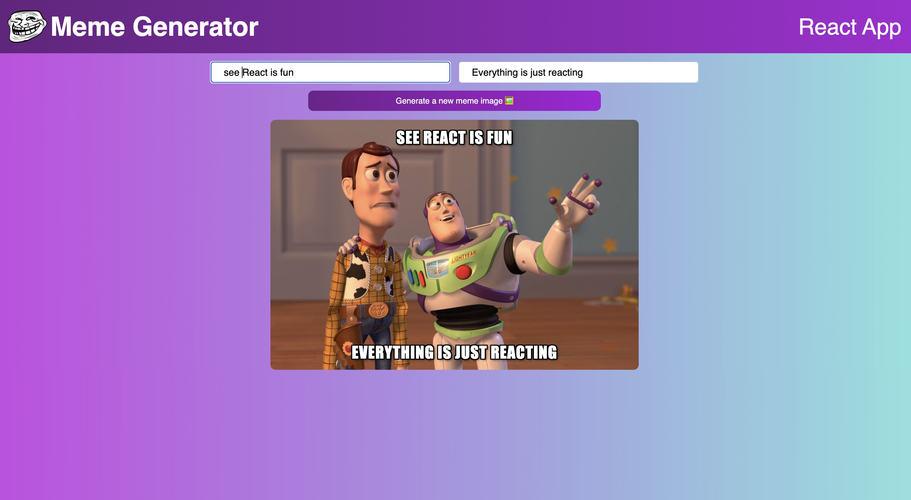

## Meme Generator React App

## Project Overview

The React Meme Generator is a web application that allows users to generate memes using popular meme templates from the Imgflip API. The app uses controlled forms to handle input values, useState to manage state, and useEffect to fetch data from the Imgflip API. Users can add text to the top and bottom of the selected meme template and generate a new meme by clicking the generate a new meme image.

## Prerequisites

To get started with the project, you need to have Node.js and npm installed on your computer. If you don't have them installed, please follow the instructions on Node.js website to download and install them.

To get started with this project, follow these steps:

1. Clone the repository to your local machine.
2. Navigate to the project directory and install the dependencies by running npm install.
3. Start the development server by running npm run dev.

## API and Links

1. https://api.imgflip.com/get_memes

## React Hooks

React hooks used in the project.

1. useState
2. useEffect
